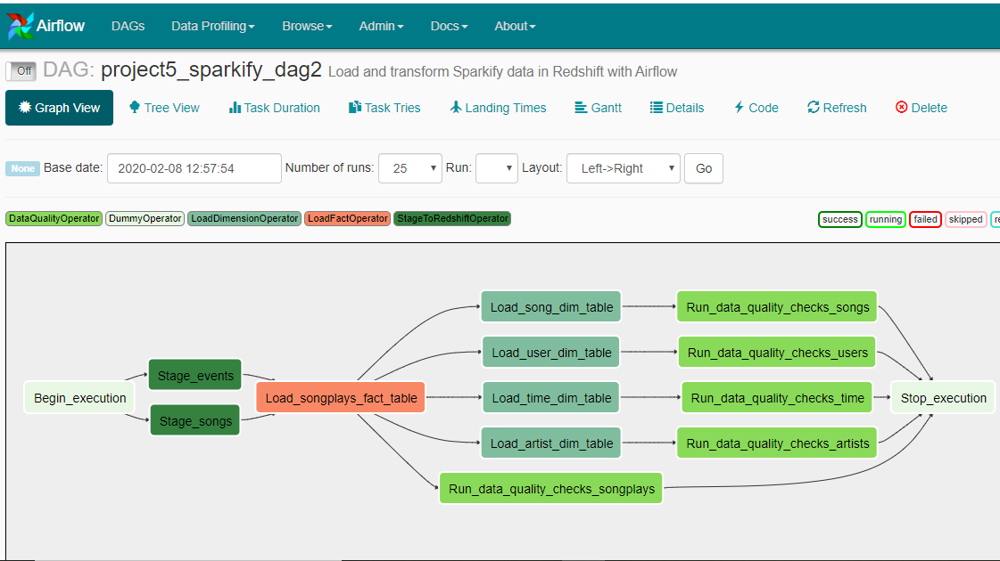
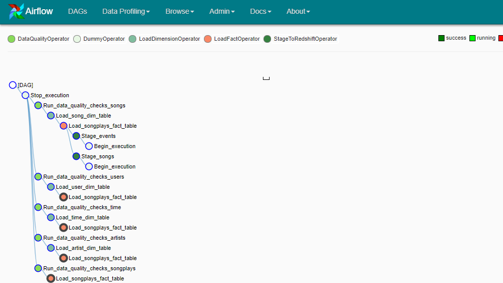

# Project 5: Data Pipelines with Airflow

* [Intro](#Intro)
* [Files structure](#Files-structure)
* [How to run](#How-to-run)

--------------------------------------------

### Intro
A music streaming company, Sparkify, has decided that it is time to **introduce more automation and monitoring to their data warehouse ETL pipelines** and come to the conclusion that the best tool to **achieve this is Apache Airflow**.

The analytics team is particularly interested in understanding what songs users are listening to. Currently, **their data resides in Amazon S3**, in a directory of JSON logs on user activity on the app, as well as a directory with JSON metadata on the songs in their app.

The goal of the project is to **create high grade data pipelines** that are dynamic and built from reusable tasks, can be monitored, and allow easy backfills. They have also noted that the data quality plays a big part when analyses are executed on top the data warehouse and want to run tests against their datasets after the ETL steps have been executed to catch any discrepancies in the datasets. In summary, the automated data pipeline cover the following ETL steps:

1) Load JSON files from S3 to staging tables in Amazon Redshift
2) Create Fact and Dimension tables in Redshift
3) Insert data from staging tables to Fact and Dimenion tables 
3) Check data quality in Fact an Dimension tables

For each of thes steps the idea is to create custom operators in Airflow that perform related tasks.

The following grapsh show the final DAG configuration:  

### Files structure

Data is pre-loaded in a public S3 bucket on the us-west-2 region as follows:
* Song data: `s3://udacity-dend/song_data`
* Log data: `s3://udacity-dend/log_data`

The project template package contains three major components for the project:  
* The dag template has all the imports and task templates in place, but the task dependencies have not been set  
* The operators folder with operator templates  
* A helper class for the SQL transformations

The following custom operators have been built: 

* _StageToRedshiftOperator_  
* _LoadFactOperator_  
* _LoadDimensionOperator_
* _DataQualityOperator_

### How to run
The primary file in the repo is `udacity_example_dag.py`, which generates the DAG wth all required tasks to perform the ETL steps above. It's available under this path: `airflow>dags`.

Operators can be found under `airflow>plugins>operators`, while all create/insert SQL queries are placed into `sql_queries.py` file under `airflow>plugins>helpers`

Steps required to run the project:
1. Create a cluster in Amazon Redshift.
2. Make sure to create all required tables (the above DAG doesn't include a task for this).
3. Set up connections in Airflow web interface to store your AWS credentials (to access S3 files) and Redshift credentials (to access Redshift cluster).
4. Start the Airflow web server and access your Airflow UI. From here you can start running and monitoring your DAG.

*Note:* We recommend to delete your Amazon Redshift cluster when finished to avoid incurring in unwanted costs.

